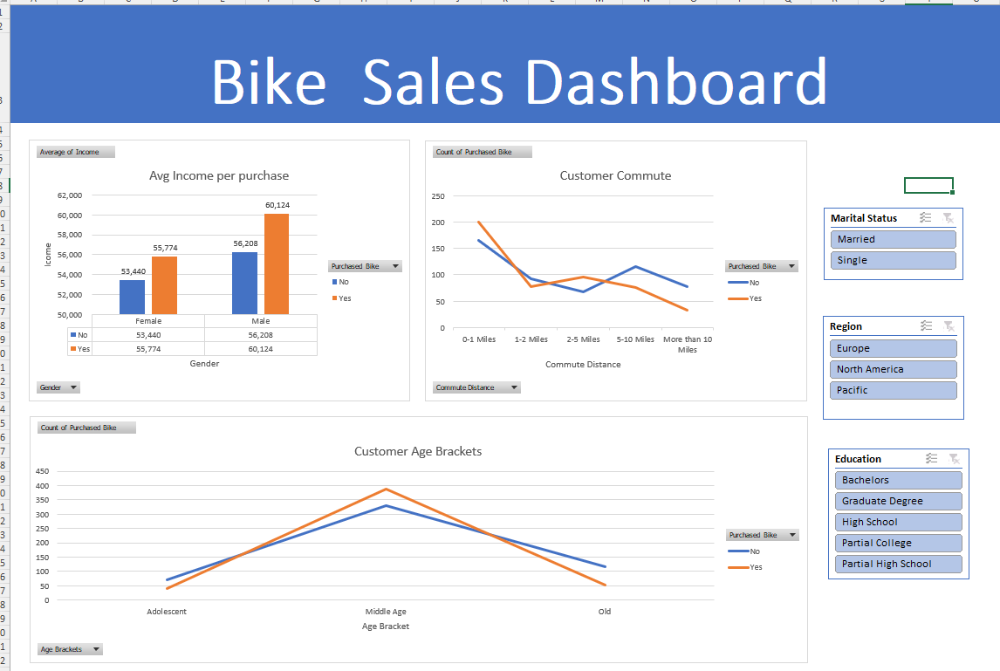

# 🚲 Bike Sales Excel Dashboard

## 📊 Dashboard Preview

---

## 📌 Project Overview
This project is an **interactive Excel dashboard** that analyzes bike sales data and customer demographics. The dashboard provides insights into customer purchasing behavior using visualizations and filters.

The project includes **data cleaning, analysis, and visualization using Microsoft Excel.**

---

## 🛠 Tools Used
- Microsoft Excel
- Pivot Tables
- Pivot Charts
- Excel Formulas
- Data Cleaning
- Dashboard Design
- Slicers (Interactive Filters)

---

## 📈 Dashboard Features

### 1️⃣ Average Income per Purchase
- Compares income levels of customers who purchased bikes vs those who did not
- Broken down by gender

### 2️⃣ Customer Commute Analysis
- Shows bike purchases based on commute distance
- Helps identify commuting patterns of buyers

### 3️⃣ Customer Age Brackets
- Displays purchase behavior by age group
- Helps identify target customer segments

### 4️⃣ Interactive Filters
Users can filter the dashboard using:

- Marital Status
- Region
- Education Level

---

## 🔎 Key Insights

- **Middle-aged customers** are more likely to purchase bikes.
- Customers with **higher income** tend to buy more bikes.
- **Male customers** show slightly higher bike purchases.
- Customers with **shorter commute distances** purchase bikes more frequently.

---

## 📂 Files Included

- `Bike Excel DashBoard.xlsx` → Excel dashboard file
- `README.md` → Project documentation
- `image/` → Dashboard screenshots

---

## 👤 Author

**Keerthi Yetukuri**  
Data Analyst
